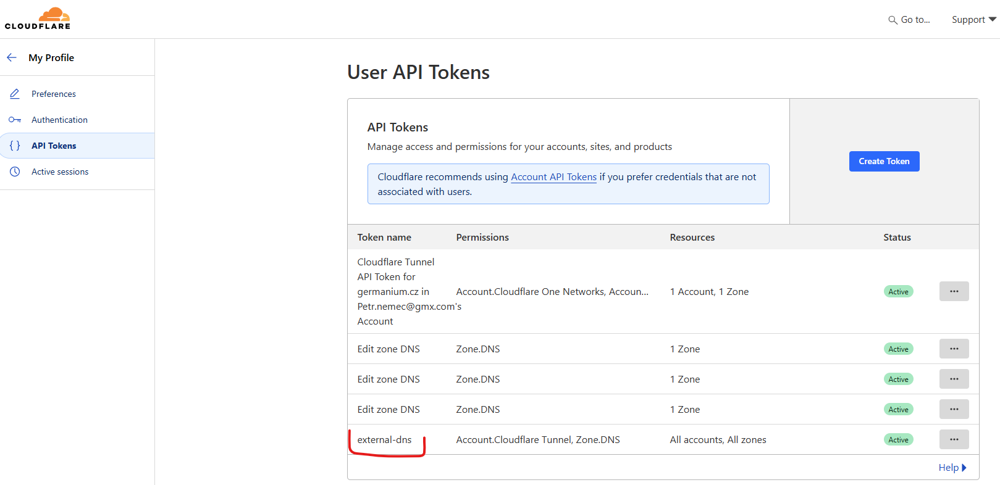

# Cloudflared

## Create a tunnel with cloudflared

To do so first a create a token in Cloudflare UI and call it i.e. "external-dns".



Save it in your password manager (search for "cloudflare external-dns API key")

To verify the token run the following:

curl "https://api.cloudflare.com/client/v4/user/tokens/verify" \
     -H "Authorization: Bearer \<use API token here>"


Now you can create your tunnel

```PowerShell
cloudflared tunnel create k8s-ingress
```

Tunnel credentials are written to C:\Users\PetrNěmec\.cloudflared\f14686c6-e006-4076-9b65-a84d93aa2e01.json. It will have a following structure

{"AccountTag":"","TunnelSecret":"","TunnelID":"","Endpoint":""}


## Create a sealed secret

The [Helm chart](https://github.com/kubitodev/helm/releases) uses a secret with stringData `tunnel-config.json` to be mounted to the PODs. The secret can be created as part of the Helm deploymnet with the name `tunnel-secret` or it can be created separatelly and then it might be referenced as existingSecret and mounted to the POD. 

To be able to store all sensitive information in the repository the second approach with a sealed secret created separatelly has been applied.
A sealed secret can be created directly from the cloudflare JSON file. It still needs to be mapped as a file `tunnel-config.json`.

```bash
kubectl create secret generic argo-tunnel-settings \
  --namespace cloudflare \
  --from-file=tunnel-config.json=/home/petr/PetrNěmec/.cloudflared/f14686c6-e006-4076-9b65-a84d93aa2e01.json \
  --dry-run=client -o yaml | kubeseal --format=yaml > argo-tunnel-settings.yaml
```

## Install Cloudflared with Helm

```
helm upgrade cloudflared kubitodev/cloudflared --namespace cloudflare --values values.yaml
```
