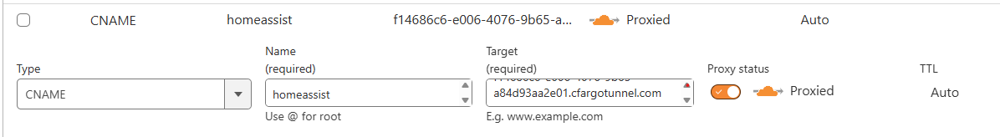

# External DNS

The externa-dns app creates CNAME records for k8s services, with the current setup it works only for ingresses.

As an example the CNAME record for homeassist redirects to f14686c6-e006-4076-9b65-a84d93aa2e01.cfargotunnel.com.



## Deployment

Go to My Profile > API Tokens and create one for external-dns
Store it to your password manager (see the item cloudflare external-dns API key) and generate a sealed secret.

```bash
kubectl create secret generic cloudflare-external-dns -n cloudflare \
    --from-literal=apiKey <cloudflare API token> \
    --dry-run=client -o yaml | kubeseal --format=yaml > sealedsecrets-cloudflare.yaml
```

### Using Helm (deprecated)

```zsh
helm repo add kubernetes-sigs https://kubernetes-sigs.github.io/external-dns/
helm repo update
helm upgrade --install external-dns kubernetes-sigs/external-dns \
  --namespace cloudflare \
  --set 'sources[0]=ingress' \
  --set policy=sync \
  --set provider.name=cloudflare \
  --set 'env[0].name=CF_API_TOKEN' \
  --set 'env[0].valueFrom.secretKeyRef.name=cloudflare-external-dns' \
  --set 'env[0].valueFrom.secretKeyRef.key=apiKey' \
  --wait
```

### Using ArgoCD

## Ingress

The following annotations need to be added to your ingress manifest to have CNAME record created by external-dns

```
    annotations:
      external-dns.alpha.kubernetes.io/cloudflare-proxied: "true"
      external-dns.alpha.kubernetes.io/hostname: homeassist.germanium.cz
      external-dns.alpha.kubernetes.io/target: f14686c6-e006-4076-9b65-a84d93aa2e01.cfargotunnel.com  # <<< The tunnelID from cloudflared app.
```
