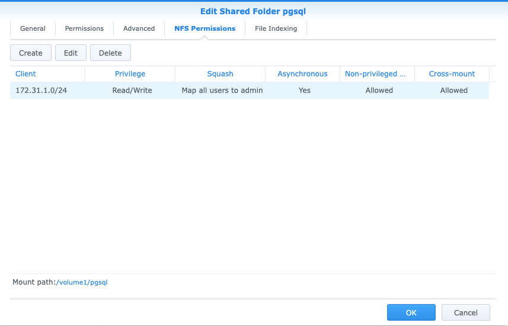
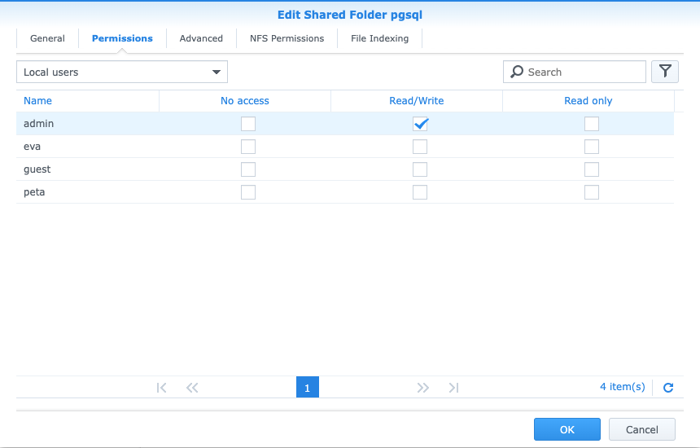
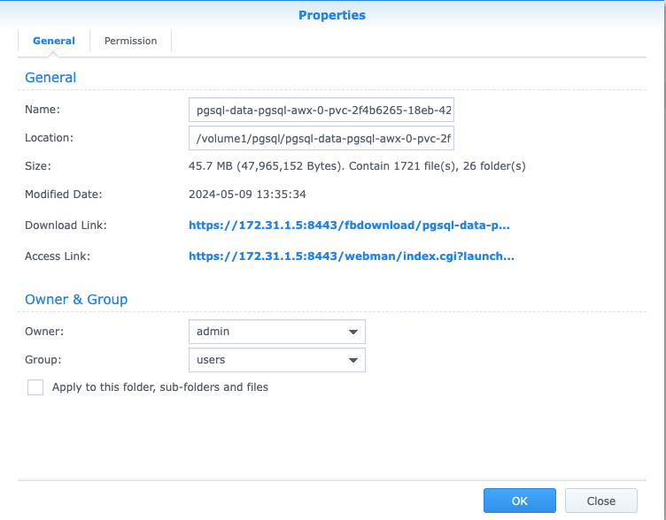

# NFS provisioner for Postgres

## Installation

### Helm

All values are documented here

https://github.com/kubernetes-sigs/nfs-subdir-external-provisioner/blob/master/charts/nfs-subdir-external-provisioner/values.yaml


## NSF

The NFS volume exposed on Synology server claims the ownership of the shares as of the user admin (1024).
The K8s nodes are configured with the following parameters as shown below, i.e. the local user `postgres` having uid`1024` is mapped as admin on the server side.

```
❯ cat /etc/idmapd.conf
[General]

Verbosity = 0
# set your own domain here, if it differs from FQDN minus hostname
Domain = germanium.home

[Mapping]

Nobody-User = postgres
Nobody-Group = postgres

❯ cat /etc/passwd | grep 1024
postgres:x:1024:1024::/home/postgres:/usr/bin/zsh
```

### Synology (NFS server)

#### NFS Permissions
Use the option *"Map all users to admin"*


#### Permissions
Make sure the user admin has RW permission to the volume.


### Ownership
Make sure the folder representing the PVC used by the Postgres is owned by user admin and group users.


